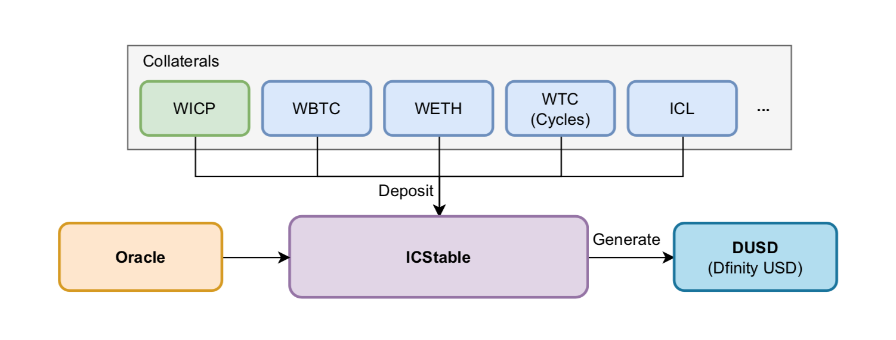

# ICStable

An overcollateralized stablecoin protocol that supports multiple collateral portfolios.

## Introduction

ICStable is an overcollateralized stablecoin protocol that supports multiple collateral portfolios. Collateral is DRC20 or DIP20 standard tokens, including ICP (wrapped), BTC (wrapped), ETH (wrapped), Cycles (wrapped), ICL, and assets added through governance.

## How it works

ICStable supports multiple assets as collateral, with ICP as the primary collateral, and collateral asset types can be added through governance. Borrowers create DUSDs by depositing collateral and hold debt positions. ICStable accepts ICOracle's price feed service, which is a decentralised Oracle smart contract. ICStable's risk control rules are that the collateral ratio for debt positions need to be kept above the liquidation line (minimum collateral ratio) and if the collateral ratio falls below the liquidation line, automatic liquidation will occur. The liquidation process will start by selling the collateral through Dex and if Dex does not have sufficient liquidity, it will be exchanged for DUSD through the system liquidity pool. The system liquidity pool is created by the Liquidity Provider of Last Resort (LPOLR) by adding DUSD and they have the opportunity to buy the collateral at a discount. ICStable has designed mechanisms to anchor 1DUSD=1USD, including, 1) arbitrage mechanism and 2) price change automatic feedback mechanism (PCAFM).

## Roadmap

* ICOracle 0.5 alpha version (done): Feed price from ic network, ICSwapHouse Dex, Market.
* ICStable v0.1 test version (done): Open debt position, Remove collateral, Add collateral, Generate DUSD, Payback DUSD.
* ICStable v0.2 test version (doing): Liquidation, Global liquidation, PCAFM, CRAFM.
* ICStable v0.5 alpha version (todo).
* ICStable v0.6 beta version (todo).

## Demo

https://pd5s3-6aaaa-aaaaj-aincq-cai.raw.ic0.app/